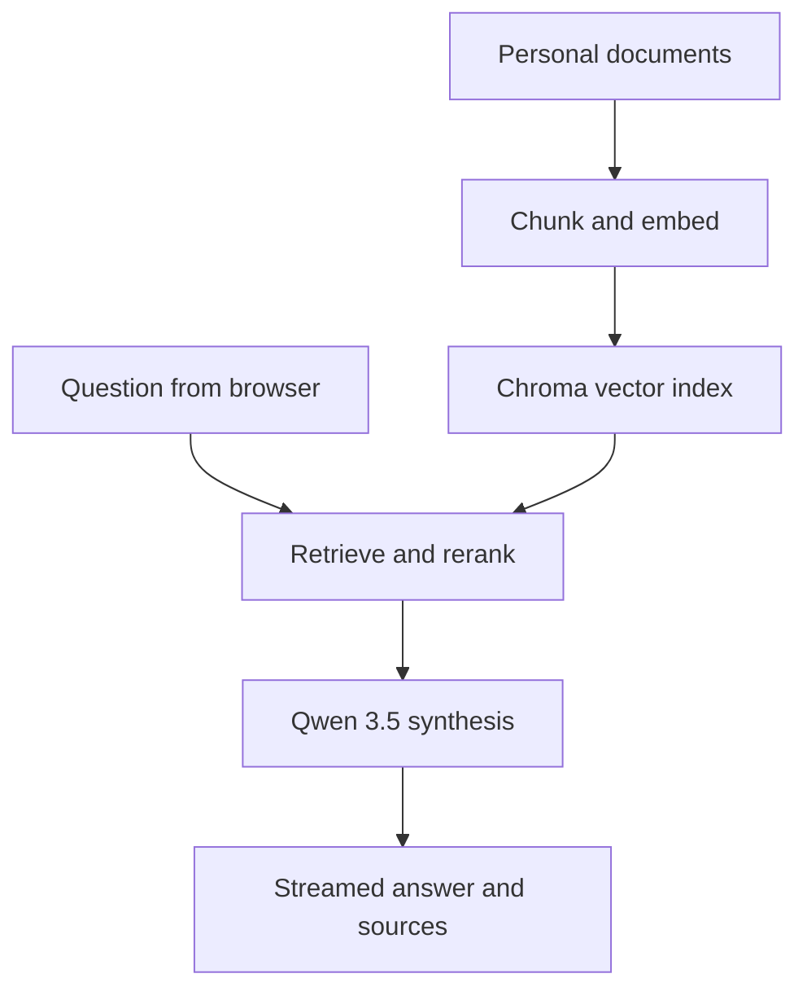

# Marginalia

[](https://www.python.org/)
[](https://svelte.dev/)
[](https://www.docker.com/)
[](#project-status)

> A local-first RAG workspace for asking questions of your own writing.

Marginalia turns a folder of personal documents into a searchable, conversational archive. It is designed primarily for journals, essays, research notes, stories, and other long-form writing. Instead of searching only for exact phrases, Marginalia retrieves related passages and asks a locally hosted language model to identify recurring themes, tensions, and unexpected connections across your work.

All document retrieval and model inference run locally through [LM Studio](https://lmstudio.ai/). Marginalia uses the OpenAI-compatible API exposed by LM Studio; it does not require an OpenAI API key or send requests to OpenAI.

## Features

- Index a local folder of UTF-8 text documents from the browser.
- Split writing into overlapping passages and store embeddings in Chroma.
- Retrieve semantically relevant passages for each question.
- Rerank retrieved passages with a local Qwen reranker.
- Stream Qwen 3.5 responses to a Svelte interface.
- Display the source passages consulted for each answer.
- Preserve the vector index between Docker sessions with a named volume.

## How it works



The current retrieval pipeline:

1. Splits each document into 300-character chunks with 20 characters of overlap.
2. Embeds and stores the chunks in a Chroma collection using `qwen3-embedding`.
3. Retrieves up to 20 passages above the configured similarity threshold.
4. Reranks those passages with `qwen3-reranker-0.6b` and keeps the top five.
5. Loads the full source documents associated with those passages.
6. Sends that context to `qwen/qwen3.5-9b` and streams the response to the browser.

## Project status

Marginalia is an early-stage prototype. It is suitable for local experimentation, but its interfaces, model configuration, storage behavior, and retrieval strategy may change.

Current constraints include:

- Documents must be UTF-8 text files.
- Only files directly inside the selected folder are indexed; nested folders are not scanned.
- Model identifiers and the LM Studio URL are currently configured in code.
- Authentication is not implemented, and the API currently allows cross-origin requests. Run it only in a trusted local environment.
- `tests.py` is reserved for future automated tests and is not yet an active test suite.

## Requirements

- [Docker](https://docs.docker.com/get-docker/)
- [LM Studio](https://lmstudio.ai/)
- A system capable of running the selected Qwen models
- The following models available to the LM Studio server under these identifiers:

| Purpose | Model identifier used by Marginalia |
| --- | --- |
| Response generation | `qwen/qwen3.5-9b` |
| Embeddings | `qwen3-embedding` |
| Reranking | `qwen3-reranker-0.6b` |

If LM Studio exposes different identifiers for your downloaded models, update the corresponding values in `chunking.py` and `reranker.py`.

## Quick start

### 1. Clone the repository

```bash
git clone https://github.com/pneumatick/marginalia.git
cd marginalia
```

### 2. Start LM Studio

Download the required models, make them available to the local server, and start LM Studio's API server on port `1234`. Because Marginalia runs in Docker, enable **Serve on Local Network** in LM Studio's Developer settings so the container can reach the server.

You can start the server from LM Studio's **Developer** tab or with its CLI:

```bash
lms server start --port 1234 --bind 0.0.0.0
```

Marginalia expects the OpenAI-compatible API at `http://host.docker.internal:1234/v1` from inside its Docker container. Binding LM Studio beyond `127.0.0.1` can make it visible to other devices, so use a trusted network and restrict port `1234` with your firewall.

### 3. Run Marginalia

Replace `/absolute/path/to/your/writings` with the folder containing the documents you want to index.

```bash
docker build -t marginalia .

docker run --rm -it \
  --add-host=host.docker.internal:host-gateway \
  -p 5173:5173 \
  -p 5000:5000 \
  -v "/absolute/path/to/your/writings:/workspace/user-docs:ro" \
  -v marginalia-index:/workspace/chroma \
  marginalia
```

The `marginalia-index` volume keeps the Chroma index between container runs. The `--add-host` option lets Linux containers reach LM Studio on the host; Docker Desktop generally provides this hostname already, but accepting the explicit mapping is harmless on current Docker versions.

### 4. Index and explore your writing

1. Open [http://localhost:5173](http://localhost:5173).
2. Select **index writings**.
3. Leave the folder as `user-docs` when using the Docker command above.
4. Select **add to archive**.
5. Ask a question such as:

   - *What themes recur across these essays?*
   - *How has my view of creativity changed over time?*
   - *Where do my journal entries contradict one another?*
   - *Which ideas appear in both my research notes and fiction?*

Index only documents you are comfortable making available to the local processes running on your machine. Although Marginalia is designed for local use, your Docker and LM Studio configuration ultimately determines where data is processed.

## Project structure

| Path | Role |
| --- | --- |
| `main.py` | Flask application and HTTP/SSE API routes |
| `chunking.py` | Document ingestion, chunking, vector storage, retrieval, and response generation |
| `reranker.py` | LangChain document compressor backed by the local Qwen reranker |
| `src/` | Svelte browser interface |
| `tests.py` | Placeholder for the future test suite |
| `Dockerfile` | Container image definition |
| `entrypoint.sh` | Starts Vite, Chroma, and Flask |
| `requirements.txt` | Python dependencies |
| `package.json` | Frontend dependencies and scripts |

## API

The Svelte frontend uses the following Flask routes:

| Method | Route | Description |
| --- | --- | --- |
| `GET` | `/api/health` | Reports whether the backend is available |
| `POST` | `/api/add_docs` | Indexes documents from the supplied `dirname` |
| `POST` | `/api/query/stream` | Retrieves context and streams an answer as Server-Sent Events |

Example request:

```bash
curl -N http://localhost:5000/api/query/stream \
  -H "Content-Type: application/json" \
  -d '{"query":"What patterns recur in my writing about work?"}'
```

## Development

The container starts three local services:

| Service | Address | Purpose |
| --- | --- | --- |
| Vite | `http://localhost:5173` | Frontend development server |
| Flask | `http://localhost:5000` | Application API |
| Chroma | `http://localhost:8000` inside the container | Vector database |

Frontend commands are available through npm:

```bash
npm run dev
npm run build
npm run preview
```

The Python backend depends on the packages in `requirements.txt`. At present, the configured LM Studio hostname is intended for the Docker workflow; running the backend directly on the host requires changing `host.docker.internal` to `localhost` in `chunking.py`.

## Contributing

Issues and focused pull requests are welcome. Because Marginalia is still evolving, please describe the problem being solved, note any retrieval or model behavior changes, and include tests when a test framework is established.

## License

No license has been added to this repository yet. Until one is provided, the project remains subject to standard copyright restrictions.
